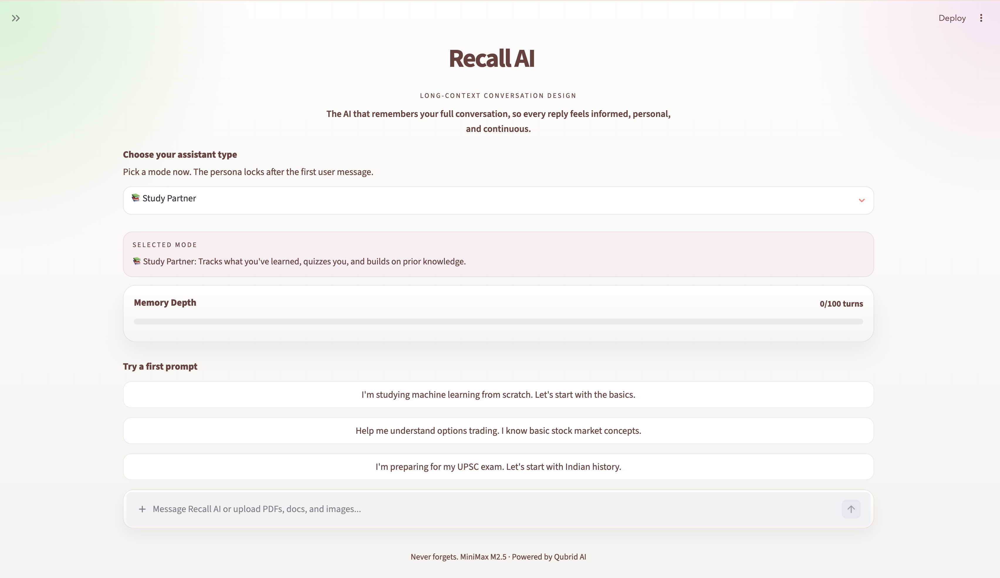
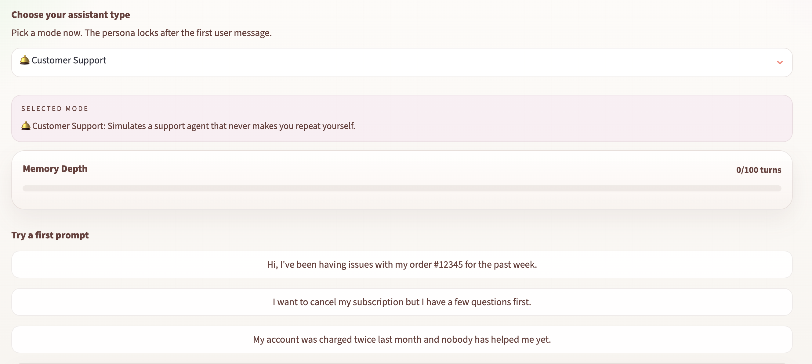
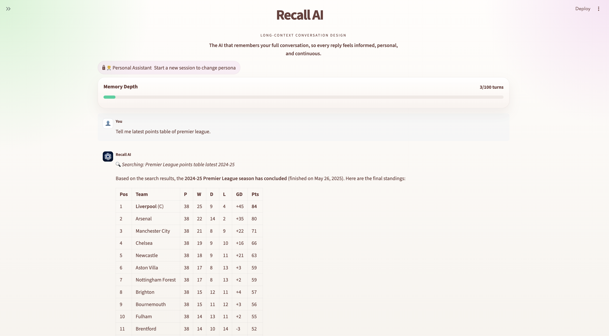
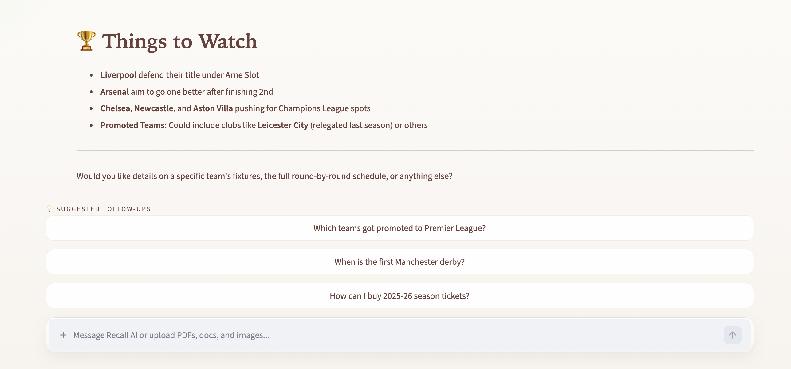
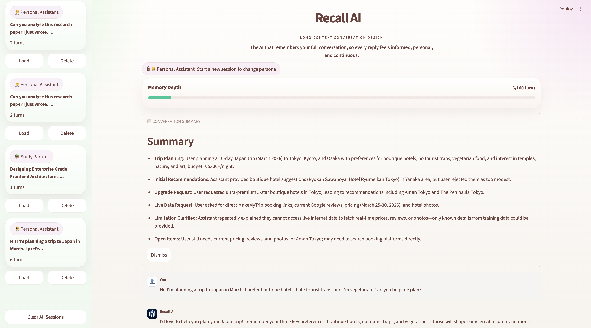

<div align="center">


# Recall AI 🧠

**Every word, remembered.**
A long-context, agentic AI assistant that never forgets — with autonomous web search, live follow-up suggestions, and persistent memory across every conversation.

<br>

[](https://www.python.org/)
[](https://streamlit.io/)
[](https://www.minimaxi.com/)
[](https://qubrid.com)
[](LICENSE)

</div>

---

## What it does

Recall AI is a context-aware, multi-persona, agentic chat assistant that remembers everything. While most AI apps lose track after a few exchanges, Recall AI retains the full thread, references past details proactively, and never asks you to repeat yourself.

It is built around a **3-node agent graph** that runs on every turn:

```
User message
    ↓
[Router] — model decides: do I need to search the web?
    ↓ (if yes)
[Tool]   — DuckDuckGo runs, results injected into context
    ↓
[Response] — final answer streamed with full memory + grounded results
```

After each response, two more agents fire automatically: one generates follow-up questions, another writes a smart session title.

---

## 📸 Screenshots

### 🏠 Home — Persona Selection + Starter Prompts


*Choose a persona and pick a curated starter prompt, or type your own. The persona locks in once you send your first message.*

---

### 💬 Multi-Turn Conversation with Memory


*The assistant proactively references earlier context — names, preferences, decisions — without being prompted.*

---

### 💡 Agentic Follow-up Suggestions


*After every response, a second agent generates 3 contextual follow-up questions as clickable chips. One click sends the message.*

---

### 🔍 Autonomous Web Search


*No toggle needed. The model decides when real-time information is required and searches DuckDuckGo automatically, showing a live `🔍 Searching…` indicator before the answer.*

---

### 📋 Conversation Summary


*Click "📋 Summarize Conversation" in the sidebar anytime. An agent produces a tight bullet-point summary of topics, decisions, and open questions.*

---

### 📚 Session History Sidebar


*All past conversations are persisted in a local SQLite database. Sessions get smart AI-generated titles automatically. Load any session in one click — the full context is restored instantly.*

---

## ✨ Features

### Core
- **🧠 Long-Context Memory** — retains the complete conversation and references prior details proactively.
- **🎭 4 Purpose-Built Personas** — Personal Assistant, Interview Coach, Customer Support, Study Partner — each with a tuned system prompt and curated starter questions.
- **📎 Multi-Format File Uploads** — PDF, DOCX, TXT, MD, CSV, JSON, PNG, JPG, WEBP, GIF — parsed and injected into context.
- **⚡ Streaming Responses** — tokens stream live, token-by-token, with no waiting for full completion.
- **📊 Context Health Bar** — live indicator (0 → 100 turns) so you always know where you are in the context window.
- **📚 Full Session History** — load, resume, or delete any past conversation from the sidebar.

### Agentic
- **🔍 Autonomous Web Search** — the model decides when to search. No toggle. Real-time DuckDuckGo results are injected before the answer is streamed.
- **💡 Follow-up Suggestions** — after every response, a second agent generates 3 contextual follow-up questions as clickable chips.
- **🏷️ Auto-Title Agent** — after the first exchange, an agent writes a smart 4-6 word session title and saves it automatically.
- **📋 Summarize Conversation** — click once in the sidebar; an agent produces a concise bullet-point summary of the current session.

---

## 🤖 How the Agent Graph Works

Each conversation turn runs a lightweight 3-step agent loop, all within a single streaming call:

| Step | What happens |
|------|-------------|
| **Router** | The model receives the system prompt + `AGENT_WEB_SEARCH_ADDENDUM`. It outputs `[SEARCH: query]` as its very first token if it needs real-time info — otherwise responds directly. |
| **Tool** | If `[SEARCH: ...]` is detected in the token buffer, the stream is drained, DuckDuckGo runs, and results are injected into context. |
| **Response** | The model re-streams a grounded answer using the search results (or streams directly if no search was needed). |

After streaming completes, two post-response agents fire sequentially:
- **Follow-up agent** — generates 3 short questions from the recent context.
- **Title agent** — generates a session title (first turn only).

All prompts for every agent live in `config/prompts.py` for easy editing.

---

## 🎭 Personas

| Persona | What it does |
|---------|-------------|
| 🧑‍💼 **Personal Assistant** | Tracks tasks, preferences, and decisions. Proactively reminds you of action items and spots patterns. |
| 🎤 **Interview Coach** | Remembers every answer, tracks improvement across the session, and delivers targeted feedback. |
| 🛎️ **Customer Support** | Never asks you to repeat yourself. References your issues, name, and history throughout the conversation. |
| 📚 **Study Partner** | Tracks what you've learned, builds on prior explanations, and quizzes you on earlier material. |

---

## 🎯 How It Works

1. **Choose** → Select a persona that fits your goal.
2. **Start** → Pick a starter prompt or type your own question.
3. **Attach** → Upload PDFs, docs, or images for the model to analyse in context.
4. **Chat** → Recall AI responds with full memory of everything said before — and searches the web automatically when needed.
5. **Follow up** → Click any of the 3 suggested follow-up questions to continue instantly.
6. **Resume** → Every session is saved and auto-titled. Come back any time and pick up exactly where you left off.

---

## 📁 Project Structure

```
recall-ai/
├── app.py                    # Main Streamlit application & agent orchestration
│
├── config/
│   ├── prompts.py            # All LLM prompts — guardrails, agent instructions, templates
│   └── settings.py           # App config — model, personas, colours, file types
│
├── backend/
│   ├── api_client.py         # Qubrid streaming client + all agent functions
│   ├── memory.py             # Context window management and memory stats
│   ├── attachments.py        # File parsing (PDF, DOCX, images, text)
│   └── tools.py              # DuckDuckGo web search tool
│
├── frontend/
│   ├── components.py         # Streamlit UI components
│   ├── styles.py             # Global custom CSS
│   └── assets/               # Screenshots and logo
│
├── database/
│   └── db.py                 # SQLite session and message persistence
│
├── .env.example              # API key template
├── pyproject.toml            # UV dependency management
└── README.md
```

**Where to look for what:**
- Edit AI behaviour & agent prompts → `config/prompts.py`
- Change personas or model → `config/settings.py`
- Add a new agent tool → `backend/tools.py` + `backend/api_client.py`
- Change the UI → `frontend/components.py` + `frontend/styles.py`

---

## 🛠️ Tech Stack

| Layer | Technology |
|-------|-----------|
| UI Framework | Streamlit + Custom CSS |
| Language Model | MiniMax M2.5 (`MiniMaxAI/MiniMax-M2.5`) |
| API Infrastructure | [Qubrid AI](https://platform.qubrid.com) |
| Web Search | DuckDuckGo (`ddgs`) — agentic, model-initiated |
| File Parsing | PyPDF, stdlib DOCX (zipfile + ElementTree), Pillow (images) |
| Database | SQLite3 |
| Dependency Management | `uv` |

---

## 🚀 Quick Start

### Prerequisites

- Python 3.10+
- A [Qubrid AI](https://platform.qubrid.com) API key
- `uv` package manager (recommended)

### Installation

```bash
# 1. Clone repository
git clone https://github.com/aryadoshii/recall-ai.git
cd recall-ai

# 2. Install UV package manager
curl -LsSf https://astral.sh/uv/install.sh | sh
source ~/.zshrc

# 3. Create and activate virtual environment
uv venv
source .venv/bin/activate  # macOS/Linux

# 4. Install dependencies
uv sync

# 5. Set up API key
cp .env.example .env
nano .env  # Add your QUBRID_API_KEY

# 6. Run the app
streamlit run app.py
```

---

## 💡 What Makes This Different

Most chat apps treat memory as a nice-to-have and reasoning as a black box. Recall AI is built around two ideas:

**1. Full-context memory as the core product.** The entire conversation is always in context. The personas aren't just different system prompts — they're built around use cases where memory is the killer feature: a coach that tracks your improvement turn by turn, a support agent that never needs you to re-explain, a study partner that quizzes you on what you covered last time.

**2. The model acts, not just responds.** The web search isn't a button — the model decides when it needs current information and searches automatically. Follow-up suggestions aren't canned — a second agent reads the conversation and generates them fresh. Session titles aren't timestamps — a third agent writes a real title. Every turn has agents working behind the scenes.

---

<div align="center">

**Made with ❤️ by Qubrid AI**

</div>
