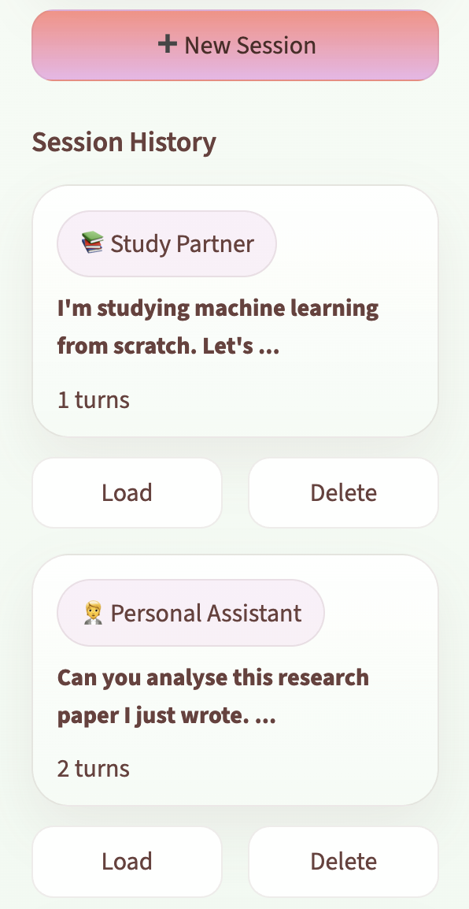

<div align="center">


# Recall AI 🧠

**Every word, remembered.**
Chat with an AI that never forgets — across documents, images, and long conversations.

<br>

[](https://www.python.org/)
[](https://streamlit.io/)
[](https://www.minimaxi.com/)
[](https://qubrid.com)
[](LICENSE)

</div>

---

## What it does

Recall AI is a context-aware, multi-persona chat assistant that remembers everything — across your entire conversation. While most AI chat apps lose track after a few exchanges, Recall AI retains the full thread, references past details proactively, and never asks you to repeat yourself.

Switch between four purpose-built personas, upload PDFs, documents, and images, and get real-time web search when you need current information — all in one place, powered by **MiniMax M2.5** via [Qubrid AI](https://qubrid.com).

- **Perfect Memory** — the full conversation is retained and referenced at every turn.
- **4 Distinct Personas** — Personal Assistant, Interview Coach, Customer Support, Study Partner.
- **File Understanding** — upload PDFs, DOCX, TXT, CSV, JSON, and images for in-context analysis.
- **Live Web Search** — agentic DuckDuckGo search triggered automatically for real-time queries.
- **Persistent Session History** — every conversation is saved to SQLite and reloadable from the sidebar.
- **Context Health Meter** — a live indicator showing how deep into long-context territory you are.

---

## 📸 Screenshots

### 🏠 Home — Persona Selection + Starter Prompts


*Choose a persona and pick a curated starter prompt, or type your own. The persona locks in once you send your first message.*

---

### 💬 Multi-Turn Conversation with Memory


*The assistant proactively references earlier context — names, preferences, decisions — without being prompted.*

---

### 📎 File Upload & Document Analysis


*Drop in a PDF, DOCX, spreadsheet, or image. Extracted text is injected directly into context for accurate, grounded answers.*

---

### 🔍 Real-Time Web Search


*Ask about current events, prices, or live data — Recall AI searches the web automatically and answers with fresh results.*

---

### 📚 Session History Sidebar


*All past conversations are persisted in a local SQLite database. Load any previous session in one click — the full context is restored instantly.*

---

## ✨ Features

- **🧠 Long-Context Memory** — retains the complete conversation and references prior details proactively.
- **🎭 4 Purpose-Built Personas** — each with a tuned system prompt, tailored starter questions, and a distinct interaction style.
- **📎 Multi-Format File Uploads** — PDF, DOCX, TXT, MD, CSV, JSON, PNG, JPG, WEBP, GIF — all parsed and injected into context.
- **🔍 Agentic Web Search** — real-time DuckDuckGo search, triggered automatically or by model request, with a multi-round agentic loop.
- **📊 Context Health Bar** — live indicator (Fresh → Deep → Very Deep → Maximum) so you always know where you are in the context window.
- **📚 Full Session History** — load, resume, or delete any past conversation from the sidebar.
- **✏️ New Chat** — clear the workspace instantly and start fresh without losing your history.
- **💡 Starter Prompts** — curated first messages for each persona to get conversations going immediately.
- **⚡ Streaming Responses** — tokens stream live, token-by-token, with no waiting for full completion.

---

## 🎭 Personas

| Persona | What it does |
|---------|-------------|
| 🧑‍💼 **Personal Assistant** | Tracks tasks, preferences, and decisions. Proactively reminds you of action items and spots patterns. |
| 🎤 **Interview Coach** | Remembers every answer, tracks improvement across the session, and delivers targeted feedback. |
| 🛎️ **Customer Support** | Never asks you to repeat yourself. References your issues, name, and history throughout the conversation. |
| 📚 **Study Partner** | Tracks what you've learned, builds on prior explanations, and quizzes you on earlier material. |

---

## 🎯 How It Works

1. **Choose** → Select a persona that fits your goal.
2. **Start** → Pick a starter prompt or type your own question.
3. **Attach** → Upload PDFs, docs, or images for the model to analyze in context.
4. **Chat** → Recall AI responds with full awareness of everything said before — and searches the web when needed.
5. **Resume** → Every session is saved automatically. Come back any time and pick up exactly where you left off.

---

## 💡 What Makes This Different

Most chat apps give you a blank box and forget everything once you close the tab. Recall AI is built around **persistent, full-context memory** as the core product feature — not an afterthought.

The personas aren't just different system prompts — they're designed around use cases where memory is the killer feature: an interview coach that tracks your progress across an entire prep session, a support agent that never needs you to re-explain your issue, a study partner that builds on exactly what you covered last time.

---

## 📁 Project Structure

```
recall-ai/
├── app.py                    # Main Streamlit application
├── frontend/
│   ├── __init__.py
│   ├── components.py         # UI components (header, chat, sidebar, persona selector)
│   ├── styles.py             # Global custom CSS
│   └── assets/               # Logo and banner images
├── backend/
│   ├── __init__.py
│   ├── api_client.py         # MiniMax M2.5 streaming + agentic loop via Qubrid
│   ├── memory.py             # Context window management and memory stats
│   ├── attachments.py        # File parsing (PDF, DOCX, images, text)
│   └── tools.py              # DuckDuckGo web search tool
├── config/
│   ├── __init__.py
│   └── settings.py           # Personas, prompts, model config, file types
├── database/
│   ├── __init__.py
│   └── db.py                 # SQLite session and message persistence
├── .env.example              # API key template
├── .gitignore
├── pyproject.toml            # UV dependency management
└── README.md
```

---

## 🛠️ Tech Stack

| Layer | Technology |
|-------|-----------|
| UI Framework | Streamlit + Custom CSS |
| Language Model | MiniMax M2.5 (`MiniMaxAI/MiniMax-M2.5`) |
| API Infrastructure | [Qubrid AI](https://platform.qubrid.com) |
| Web Search | DuckDuckGo (`ddgs`) — agentic multi-round loop |
| File Parsing | PyPDF, stdlib DOCX (zipfile + ElementTree), base64 images |
| Database | SQLite3 |
| Dependency Management | `uv` |

---

## 🚀 Quick Start

### Prerequisites

- Python 3.10+
- A [Qubrid AI](https://platform.qubrid.com) API key
- `uv` package manager (recommended)

### Installation

```bash
# 1. Clone repository
git clone https://github.com/aryadoshii/recall-ai.git
cd recall-ai

# 2. Install UV package manager
curl -LsSf https://astral.sh/uv/install.sh | sh
source ~/.zshrc

# 3. Create and activate virtual environment
uv venv
source .venv/bin/activate  # macOS/Linux

# 4. Install dependencies
uv sync

# 5. Set up API key
cp .env.example .env
nano .env  # Add your QUBRID_API_KEY

# 6. Run the app
streamlit run app.py
```

---

<div align="center">

**Made with ❤️ by Qubrid AI**

</div>
